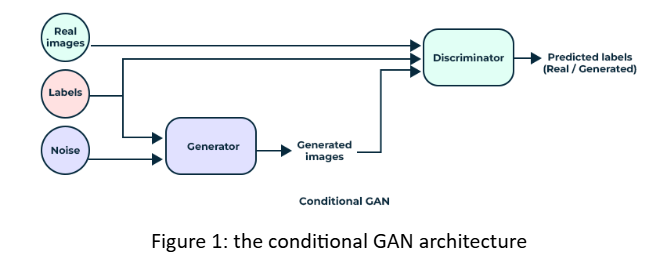
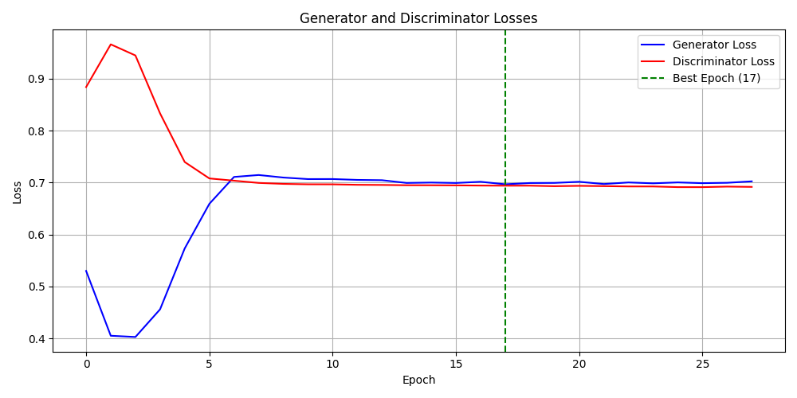
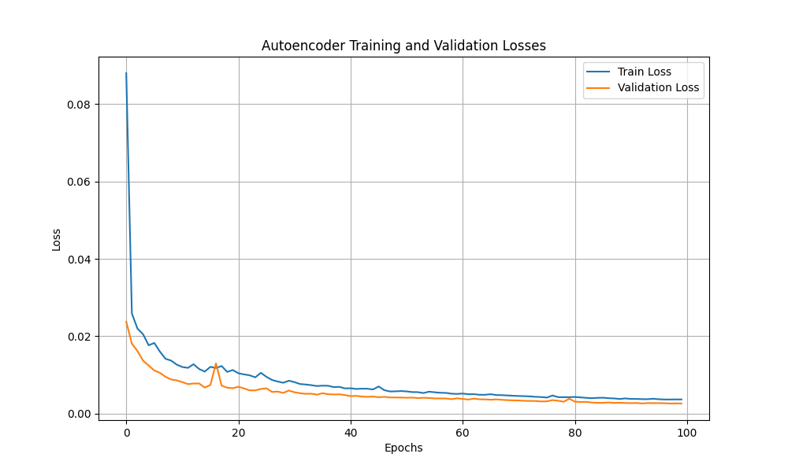
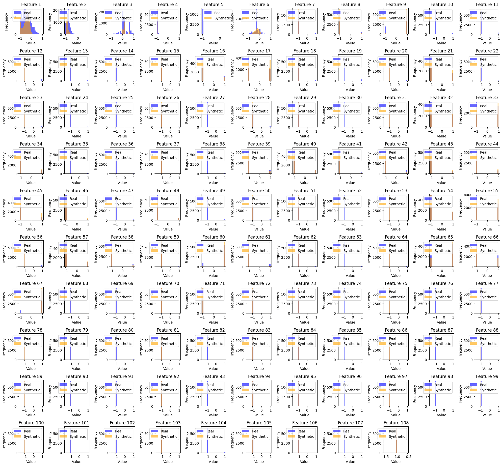
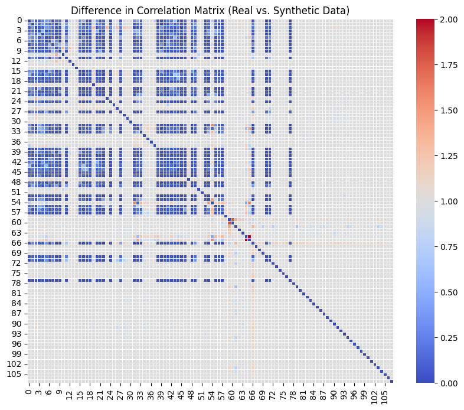

# Tabular-Data-Generation-Using-cGAN

## Overview

This project aims to generate synthetic tabular data using Conditional Generative Adversarial Networks (cGAN), with the option to apply the conditionality on both vanilla GAN and BEGAN. The approach utilizes both real and synthetic data to train models that can effectively mimic the distributions and relationships of features in the original dataset. The model is evaluated based on its ability to generate data with similar feature distributions and its performance in downstream tasks, such as detection and efficacy when used for training a Random Forest model.

This entire project is trainable on CPU.



Key highlights:
- **Conditional GAN**: The model generates synthetic data conditioned on categorical labels, ensuring that the generated data closely matches the characteristics of the original data. You can experiment with different base architectures for that (vanilla GAN, BEGAN).
- **Evaluation Metrics**: The quality of the synthetic data is evaluated using detection (AUC) and efficacy (AUC ratio), comparing real and synthetic data performance.
- **Data Preprocessing**: Features are normalized and one-hot encoded for categorical features to ensure that no unintended order is imposed on categorical data.

## Project Structure

### Key Files
- **`config.py`**: Defines model architecture, training parameters, and data handling settings. Includes optimal configurations from latest experiments. The attached report also contain the optimal configurations for initial model (eg., regular GAN, cGAN, before AE).
- **`dataset.py`**: Prepares the dataset by splitting it into training, validation, and test sets. Handles preprocessing such as one-hot encoding and normalization.
- **`gan.py`**: Implements the GAN and cGAN models for data generation.
- **`began.py`**: Implements the BEGAN and cBEGAN models integrated with a pretrained AE model, finetuned as a critic discriminator of the GAN.
- **`autoencoder.py`**: Implements the AutoEncoder model to represent the data in the latent space.
- **`Analysis.ipynb`**: A notebook for analyzing the quality of the generated data, including correlation differences and feature distributions.
- **`requirements.txt`**: Lists dependencies for running the project.
- **`report.pdf`**: Detailed documentation (in Hebrew) outlining project decisions and experiments, covering conclusions on the GAN and AE-GAN models (no BEGAN).

---

## Usage

### Dataset

The dataset used in this project is assumed to be in `.arff` format. The following preprocessing steps are applied:
- **Duplicated Column Removal**: Removing the duplicated column 'education'.
- **One-Hot Encoding**: Categorical features are one-hot encoded to avoid forcing any hierarchy using `LabelEncoder`.
- **Normalization**: Features are normalized to ensure consistent scale across all features.

### Environment Setup

Ensure you have Python installed and follow these steps to set up the environment:

```bash
python -m venv venv
venv\Scripts\activate  # On Windows
pip install --upgrade pip
pip install -r requirements.txt
```

## Features

- **GAN and Conditional GAN (cGAN)**: The project utilizes both a Generative Adversarial Network (GAN) and a Conditional Generative Adversarial Network (cGAN) to generate synthetic tabular data. The cGAN is conditioned on class labels, ensuring that the generated data matches the feature distribution of each class in the original dataset.
Both concept models are implemented in several architectures - vanilla architecture and BEGAN, both trained with added correlation diff as a loss term.

Training process offers an early stopping depending on the Generator's loss and tracking over both part's performance:



- **AutoEncoder**: An Auto Encoder model is offered in order to integrate directly within the BEGAN architecture to improve the general performance.



NOTE: This model requires longer training session, and can benefit from 100+ epochs.

- **Post Processing**: Both modules are equiped with a post processing method designated at turning the data to pure categorical when needed.

- **Detection Metric**: A Random Forest model is trained on a combined dataset consisting of both real and synthetic data. The model is evaluated on its ability to detect whether a given data point is real or synthetic, with a low AUC indicating that the synthetic data is close to the real data. The Analysis also offers feature importance using a tree method, to examine the failure points of the model.

- **Efficacy Metric**: The model evaluates whether synthetic data can replace real data in training a model. The efficacy is measured as the ratio of the AUC score of a Random Forest model trained on synthetic data to the AUC score of a model trained on real data.

- **Evaluation Visualizations**: 
  - Heatmaps of correlation differences between real and synthetic data.
  - Histograms and feature distributions comparing real and synthetic datasets.
  
- **Random Forest Training**: Multiple models are trained and evaluated using K-fold cross-validation to ensure robust results across different test sets.

---

## Results

The current implementation showed insufficient results, sufferring from difficulties in handeling the categorical data (one-hot encoded) properly. Currently, `gan.py` models performed better than `ae_gan.py` models. The `began.py` models showed slight improvement in the efficiency score, but were still unable to fool the Random Forest model. Attached are the current results from the `began.py` module, `BEGAN` model:

### Detection Metric

The detection metric evaluates how similar the synthetic data is to the real data. A low AUC score in this case is desirable, indicating that the model cannot distinguish between real and synthetic data. A high similarity between the real and synthetic data means that the model is unable to tell the difference between the two.

```
(Best) Average AUC for detection (GAN): 0.997 -> BAD! (Optimum at ~0.5)
```

### Efficacy Metric

The efficacy metric evaluates whether synthetic data can serve as a useful substitute for real data in training models. The efficacy is computed as the ratio of the AUC score for synthetic data to the AUC score for real data, with 1 being the ideal score. A higher ratio suggests that the synthetic data is of high quality and can effectively replace real data.

```
Real AUC: 0.905916742328883 
Synthetic AUC: 0.620357349208642 
Efficacy Score: 0.6848
```

### Feature Distribution Comparison

One of the most critical evaluations of the generated data is how well the feature distributions of real and synthetic datasets match. Below is a comparison of the feature distributions, highlighting the effectiveness of the model in replicating the real data distribution.



The plots show histograms of features from both real and synthetic datasets. Ideally, the synthetic data's feature distributions should closely resemble those of the real data.

### Correlation Comparison

Another critical evaluation metric is the correlation between features. The heatmap below illustrates the difference in correlations between the real and synthetic data, highlighting any discrepancies in feature relationships.



The closer the correlation difference is to zero, the better the synthetic data mimics the real data in terms of feature interrelationships. We can see a few features which were learnt badly by the model, probably causing the model's inability to fool the Random Forest classifier.

---

## GitHub
### Initiating Git Repository
To clone this repository locally:
```
git init
git remote add origin https://github.com/shaharoded/Tabular-Data-Generation-Using-cGAN.git
git status
```
Alternatively, you can initialize a local repository:
```
git clone https://github.com/shaharoded/Tabular-Data-Generation-Using-cGAN.git
```

### Git Updates
To publish updates:
```
git add .
git commit -m "commit message"
git branch -M main
git push -f origin main
```